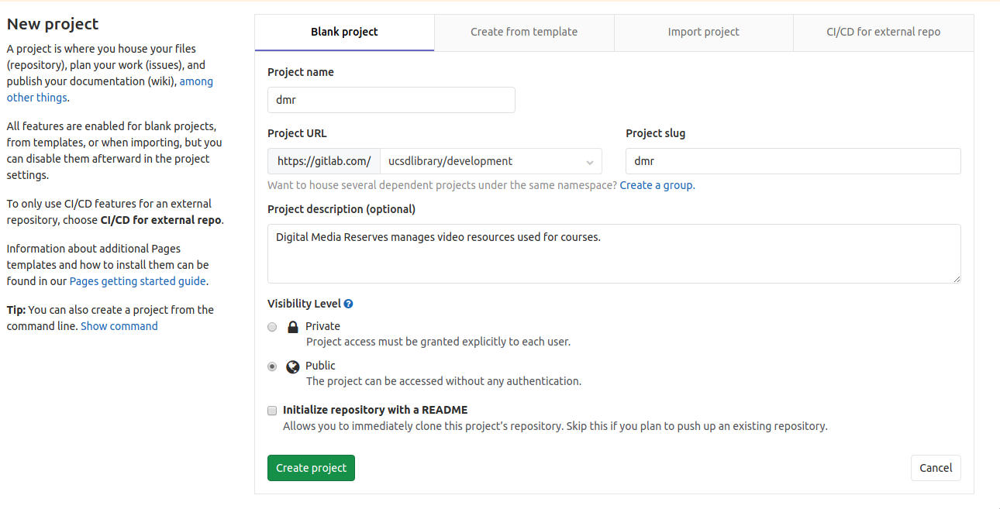
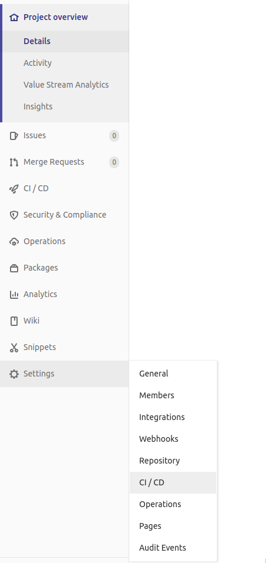
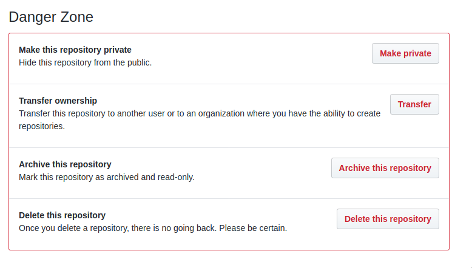

# GitHub to GitLab Repository Migration #

The following is a checklist for migrating an application from our GitHub
organization to GitLab.

## Create GitLab Repository
1. Clone the GitHub repository you intend to migrate
1. Navigate to the [UCSD GitLab Development sub-project][gitlab-dev]
1. Authenticate with your UCSD Credentials using `Google`
1. Click `New Project`
1. Add `Project Name`, `Project Description` to match GitHub repository
1. Set the `Visibility Level` to match the GitHub repository (generally, `Public`)
1. Do **NOT** initialize with a `LICENSE` or `README`
1. Click `Create Project`



## Push Repository to GitLab
1. Follow the steps outlined in the `Push an existing Git repository` section:
```
git remote rename origin old-origin
git remote add origin git@gitlab.com:ucsdlibrary/development/dmr.git
git push -u origin --all
git push -u origin --tags
```

Refresh the browser page to confirm the repository is populated on GitLab

## Configure Core Project Settings

### Get SSH key setup for Deployment (Optional)
> NOTE: Optional in some cases, such as deploying via Tomcat Manager over http(s)

In order to deploy applications via SSH, a keypair will need to be generated and
the private key added as a CI/CD environment variable. Work with Operations to
obtain these keys, generally one keypair per environment, and ensure the keys
are setup on the hosts that need to be deployed to.

> NOTE: we only are doing this because we're running all GitLab runners in our
local infrastructure, which we trust to deploy.

Go to Settings -> CI/CD:



1. Click `Expand` on the `Variables` section, and create a variables for each
   SSH private key you have (per environment) named, for example,
   `SSH_KEY_STAGING`, `SSH_KEY_PRODUCTION` with the value of the key pasted in.
1. Toggle the `Protected` radio button for each variable, ensuring this variable is only
   accessible in protected branches/tags/environments. Note: `master` should be
   setup as a [protected branch][gitlab-protected-branches].
1. Click `Save Variables`

### Merge Requests
1. Navigate to Settings -> General
1. Toggle `Merge Requests`
1. Choose `Fast-forward merge`
1. Copy the contents of the [Gitlab Merge Request template][gitlab-mr-template]
   into the textarea titled `Default description template for merge requests`
   and adjust if needed.

### CI/CD Runners
1. Navigate to Settings -> CI/CD
1. Toggle `Runners`
1. In the `Shared Runners` section, click `Disable shared Runners`
1. In the `Group Runners` section, enable the group shared Runner listed. This
   is our local set of GitLab Runners running in our own infrastructure.

### Slack Integration (ChatOps, etc.)
1. Navigate to Settings -> Integrations
1. Scroll down and click `Slack Application`
1. Follow the steps to active the integration for your application
1. Now, if you have any `chatops` jobs setup in your GitLab CI file, you (or
   Operations) will be able to deploy in Slack:

Examples:
```
# Deploy the tag 1.5.0 to staging
/gitlab ucsdlibrary/apbatch run staging_deploy 1.5.0

# Deploy the master(default) branch to pontos
/gitlab ucsdlibrary/dmr run pontos_deploy
```

## Create .gitlab-ci.yml
Now we need to setup CI/CD for the project. There are a few scenarios outlined
below. Find the one that matches the project you're migrating.

In general, if there is an existing `CircleCI` or `Jenkins` build, test, and
deploy configuration, you're going to want to emulate that in GitLab's CI
system.

You also will likely want to just get the `build` and/or `test` stages passing first. Then, move on to the `deploy` stage last. This can then be proposed as a single Merge Request, or you can split it up into two if you would prefer.

### Ruby Application Deployed via Capistrano
1. Copy the [Ruby GitLab template][gitlab-ruby] into your project, renaming it
   to `.gitlab-ci.yml`
1. Update the template to match the needs of the project.
#### Capistrano Changes
There are a few other things you may need to change for migrating a project
using Capistrano.

- In `./config/deploy.rb` change `repo_url` to reference the new GitLab repo: `set :repo_url, 'https://gitlab.com/ucsdlibrary/development/dmr.git'`
- In each `./config/deploy/{environment}` file, you may have a block of code as
    below. This is no longer needed with the GitLab configuration, and may be
    removed. This is because the GitLab runner will have the key in its keychain
    already.

```
if ENV["CAP_SSHKEY_PONTOS"]
  puts "Using key: #{File.join(ENV["HOME"], ENV["CAP_SSHKEY_PONTOS"])}"
  set :ssh_options, { keys: File.join(ENV["HOME"], ENV["CAP_SSHKEY_PONTOS"]) }
end
```


### Java Application Deployed via Tomcat Manager
1. Copy the [Java Tomcat Manager GitLab template][gitlab-java-tomcat] into your project, renaming it
   to `.gitlab-ci.yml`
1. Update the template to match the needs of the project.
1. Add sensitive [environment variables][gitlab-env-vars] such as `TOMCAT_MANAGER_STAGING_PASSWORD` and others as needed to the GitLab project. You can follow the same steps as the SSH key setup, ensuring that the variable is `Protected` and, if possible, `Masked`. Non-sensitive environment variables can simply be added to the `.gitlab-ci.yml` file directly, or using an `.env` file.

### Java Application Deployed via SSH
> If this project **CAN** use Tomcat Manager, it would be preferrable to do that, as you can avoid direct SSH commands

1. Copy the [Java Tomcat Manager GitLab template][gitlab-java-tomcat] into your project, renaming it
   to `.gitlab-ci.yml`
1. Update the template to use direct SSH commands, mirroring the existing
   Jenkins set of commands. This would also include post-deploy commands such as
   restarting tomcat.

## Remove GitHub/CI Context
The goal here is to remove any content in the repository that is specific to
GitHub and any existing CI tools such as `CircleCI`, `Hound`, etc.

1. Create a new branch off `master` in the GitLab repo
1. Remove files such as: `.circleci/*` and `.github/*`
1. Create a `Merge Request` to make these changes and ping someone on the
   Development team for a review

## Archive GitHub Repository

### Pre-Archive Checklist
1. All branches and tags have successfully migrated to GitLab for this
   repository
1. Merge Requests trigger appropriate `build`, `test`, pipelines
1. Deploying via GitLab functions properly in **ALL** environments

### Archive the GitHub Repository
1. Navigate to the GitHub repository and ensure you are logged in
1. Go to Settings
1. Scroll to the bottom `Danger Zone` section
1. Select `Archive this repository`



[gitlab-dev]:https://gitlab.com/ucsdlibrary/development
[gitlab-env-vars]:https://docs.gitlab.com/ee/ci/variables/
[gitlab-java-tomcat]:./templates/.gitlab-ci-java-tomcat.yml
[gitlab-mr-template]:./templates/gitlab_merge_requests.md
[gitlab-protected-branches]:https://gitlab.com/help/user/project/protected_branches.md
[gitlab-ruby]:./templates/.gitlab-ci-ruby.yml
